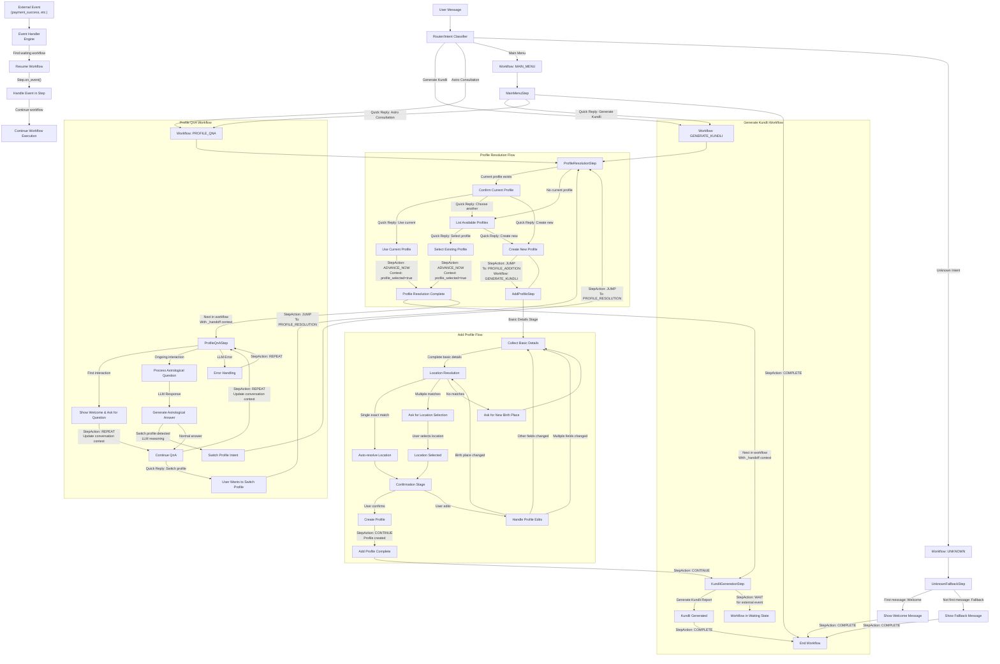

# Workflow Flow Diagram

This document provides a comprehensive visual representation of all possible workflow paths in the Luna system.

## Complete Workflow Architecture

The diagram below illustrates all possible flows between different workflows and steps in the system, including:
- Main entry points through the router/intent classifier
- Profile Resolution flow
- Add Profile flow
- Generate Kundli workflow
- Profile QnA workflow
- Main Menu flow
- Unknown/fallback flow

## Key Workflow Features

1. **Non-deterministic Flows**:
   - LLM reasoning for intent detection and profile switching creates dynamic paths
   - User selections via quick replies create branching paths
   - Error handling and fallbacks provide alternative routes

2. **Workflow Transitions**:
   - Steps can advance linearly (CONTINUE), immediately (ADVANCE_NOW), repeat for multi-turn interactions (REPEAT), or jump to other steps/workflows (JUMP)
   - StepAction.WAIT allows workflows to pause execution and wait for external events
   - Workflows can transition to other workflows with context preservation using _handoff mechanism
   - State is maintained across transitions for coherent user experience

3. **Multi-stage Operations**:
   - Profile creation involves multiple stages with data validation
   - Profile Q&A maintains conversation history for context
   - Location resolution has specialized handling for various match scenarios

4. **Context Management**:
   - The workflow engine manages context across steps and workflows
   - Structured handoffs between components maintain state through explicit _handoff context
   - Each workflow maintains its own contextual state that persists across user interactions
   - Session data persists critical information between user interactions

5. **Event Handling**:
   - Workflows can pause execution (StepAction.WAIT) to wait for external events
   - External events (like payment callbacks) can resume paused workflows
   - The on_event handler in steps processes external events when workflows are in waiting state

This diagram serves as a reference for understanding the complete flow of user interactions through the system.
